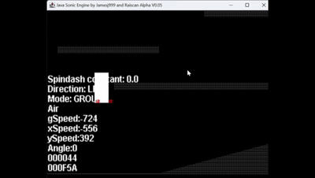
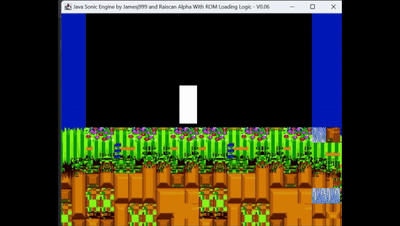

# The AI Journey

*A working journal of how AI went from "useless for this" to a measurable accuracy
multiplier on OpenGGF — and why the line "you can't prompt your way to ROM accuracy"
is no longer quite as true as it used to be.*

This is the story behind one sentence in our [README](../README.md):

> You can't prompt your way to ROM accuracy (yet!).

That parenthetical "(yet!)" is doing a lot of work. This page explains how it got there.

*Dates and claims are anchored to the commit history where possible, and to the project's
two-person chat log where the commits are silent. Where even that record is thin (early
throwaway experiments, work done over Discord), it's flagged as recollection, not fact.*

---

## 2013–2024 — James, solo, by hand

The first commit landed on **19 May 2013**, by James (`jamesj999`). For most of the next
decade this was one person teaching himself how a Mega Drive moves a hedgehog around a screen,
one stubborn detail at a time.

> *"Added basic acceleration/deceleration algorithm. Sonic now has properly configured run
> rates so our 'Sonic' will now run as if he's moving across a flat surface."*
>
> *"Fixed silly derp that caused camera to move 6 pixels at a time! (oops)"*
>
> *"Angle is now adjustable by pressing up or down"*

The hand-built core — the rendering pipeline, the physics rewrite, the subpixel movement
model, the sensor-based collision system — was designed and written by hand, over years,
working from Sonic Retro documentation and community hacking guides. Not the disassemblies;
those only became the reference much later. Even the doubt was there from early on:

> *"what the fuck were we thinking when we wanted to make a Java version of this shit"*
> — Farrell, 2017

That foundation matters to everything that follows: every later experiment with AI happened
*on top of* a hand-built engine with a hard, objective definition of "correct" — the original
ROM. There was always something to be wrong against.

### The audio that never got done

This is a two-person project — *"Jamesj999 and Raiscan,"* as the build titles still say. James
owned the engine. Audio was always Farrell's to do, and for years it simply… wasn't.

> *"I need to do muh audio bungery"* — Farrell, **Jan 2020**
>
> *"audio is a bit bung"* — James, **Jan 2022**
>
> *"No idea, I never thought about sound at all… sound was never something I thought about"*
> — James, **Sep 2024**

Hold that thread. It pays off in the most unexpected way — see [November 2025](#november-2025--agents-start-producing-work-worth-keeping).

## September 2024 — The first experiments, meant to be thrown away

The first time AI touched this project, nobody intended to keep a line of what it wrote.

The plan was deliberately cynical, and at the time the cynicism was correct: we didn't trust
the models to write good code. So the idea was never "let AI build it." It was to point AI at
the enormous body of *reference* material that already exists — Sonic Retro write-ups,
historical ROM-hacking notes — have it digest all of that and emit some terrible, barely-readable
code that nevertheless *worked*, then reverse-engineer that throwaway code by hand into something
clean enough to keep. AI as a research scratchpad, not an author.

The first real target was **Kosinski** — the compression Sonic 2 uses for its level layouts. You
can't read a level out of the ROM without decompressing it first, so it was the natural first
wall. It's also the *perfect* first AI problem, for a reason that turned out to matter enormously:
**it comes with a built-in oracle.** A decompressor is either bit-exact against the ROM or it's
wrong — there is no "looks about right."

The commit history catches the exact moment. The first AI-assisted commit in the whole repo is
**`54c7056db` (23 Sep 2024): "Kosinski Decompressor for Sonic data that's been compressed."**
Four days later, the honest follow-up: **`eed065ca3` (27 Sep 2024): "It's not working great yet."**
That's the throwaway-scratchpad loop in two commits — get something that almost works, then grind
it against the ROM until it does. The chat from those weeks is all GPT-4:

> *"I've been using ChatGPT to convert the pojos… I've got a good prompt baseline going where
> I've given it rules"* — Farrell, 24 Sep 2024
>
> *"I asked ChatGPT to interpret Nemesis' notes"* — 1 Oct 2024
>
> *"it's absolutely impossible to navigate a lot of it without chatGPT"* — 15 Oct 2024

And then the payoff, the day OpenAI's first "thinking" model landed:

> *"Chatgpt with its new thinking model did most of the conversion of that accurate kosinski"*
> — Farrell, **21 Oct 2024**

That's the whole thesis of this page in one sentence, eighteen months early: a model plus a
byte-exact oracle cracked a real Mega Drive compression format. James immediately saw where it
pointed:

> *"What we really need is an LLM with large enough recall that we can feed it the entire s2 asm
> disassembly and ask it to convert it into java"* — James, 21 Oct 2024

It was, to be clear, a mess getting there. The engine around it was still very much a work in
progress — James's hand-coded physics had Sonic sinking through the floor, and we have the receipts
(see [the hall of shame](#the-hall-of-shame)) — but that was the *human* half of the build. The
AI's job here was narrower and cleaner: turn ROM bytes into level data, verified against the ROM.
And the lesson from that half stuck: **plausibility is not accuracy, and only the ROM gets a vote.**

## June 2025 — Agentic Codex: the floodgates

The next jump wasn't a smarter chat window; it was AI that could *run things itself*. The online
version of Codex showed up and changed the texture of the work overnight:

> *"Codex stuff: it makes a VM container and runs commands rofl"* — Farrell, 8 Jun 2025
>
> *"Did some more experimenting with Codex last night. The AGENTS file helps a lot with
> sensibility. I literally can't throw features fast enough at [it]"* — 11 Jun 2025
>
> *"I like using idea for my own dev on the project, and review pull requests from codex on
> github"* — 10 Jun 2025

This is where the workflow that still runs today was born: a human writing an `AGENTS.md`,
queueing tasks, and reviewing agent PRs. The committed fingerprints are the `codex/*` branches —
`codex/explain-codebase-structure-and-learning-path` (PR #32, 9 Jun 2025),
`codex/add-unit-tests` (PR #33, 15 Jun 2025) — exploratory at first, then steadily more load-bearing.

## November 2025 — Agents start producing work worth keeping

By late November 2025 the relationship changed again: agents were now *building* whole subsystems,
not just scaffolding. Two threads ran at once.

**Online Codex stayed the steadier hand**, grounded in scavenged reference material — the
sound-engine branch (`codex/github-mention-add-sound-engine`, PR #68, 27 Nov 2025) landing next to
a *"music docs and Nemesis S2 guide"* and a `Saxman compression - Sega Retro.htm` page.

**The Jules and Gemini experiments ran in parallel — and they were a headache.** The first
*bot-authored* commits in the repo land on **24 November 2025** under `google-labs-jules[bot]`
(Google's Gemini-backed Jules agent): `AGENTS.md` edits, sprite-flipping fixes, physics-angle
corrections. Jules could go impressively deep, but steering it was the whole job — usable,
close-to-accurate code took *many* prompts and constant correction. Good rate limits, real
capability; controllability not yet there, and in honest side-by-side use it never clearly beat
Codex.

### The exception that proves the rule: audio

Remember the audio nobody got round to for five years? It finally got built in this window — but
*how* is the most important story on this page, because audio is the one place where the whole
"give the model an oracle" trick **breaks**.

The entire SMPS/YM2612 stack starts here — there are **no audio-engine commits anywhere in the repo
before it** — with **`887eca634` (27 Nov 2025): "Implement FM Instrument Loading for SMPS Audio
Engine,"** by Jules, which then generated the bulk of the scaffolding over the following weeks
(~88 commits): the YM2612 implementation (CSM, SSG-EG, attack-logic), DAC handling, the SMPS
sequencer, PSG envelopes.

But Jules had **no way of knowing whether a single note of it was correct.** A decompressor is
bit-exact or it isn't; a trace diverges on a numbered frame or it doesn't. Sound has no such
oracle — *"does this FM patch match the real Mega Drive?"* is a question a 2025 model simply could
not answer about its own output. So it confidently emitted code that produced ear-splitting
screeches and reported success.

Which meant a human had to *become* the oracle. Getting from Jules's blind first draft to something
accurate was weeks of Farrell sitting through detuned, clipping, wrong-instrument builds — ear
against the speaker, diagnosing chip-state bugs by hand in the IntelliJ debugger: FM operators,
key-on timing, DAC rate maths, one screech at a time. The agent typed; the human listened,
diagnosed, and corrected, over and over. The honest record is that the audio engine is
**AI-scaffolded and human-tuned by ear** — and it was, by some distance, the most painful work in
the whole project, precisely because there was nothing automated to be wrong against.

The crowning specimen: **Casino Night Zone confidently playing the options-menu theme**, rendered
through the half-finished FM chip as a *garbled shotgun.* It was so bad it was perfect. The
earliest recording survives — **3 December 2025**. The picture is deceptively calm; the sound is
the whole point:

<video src="assets/ai-journey/2025-12-garbled-shotgun.mp4" controls width="480"></video>

> ▶ **[Listen — the first bad-sound build (mp4, with audio)](assets/ai-journey/2025-12-garbled-shotgun.mp4)** ·
> *the joke is entirely in the audio; a GIF could never*

> *"that'll be why I could hear it going mad"* — Farrell, on an early audio build, Jan 2026
>
> *"hahaha no sound"* — James, Jan 2026

From there it was the long climb to accuracy, including discoveries like the Sonic 2 sound driver
hardcoding a wait specifically for the CPZ gloop sound:

> *"who the fuck puts that in the sound driver"* — Farrell, Jan 2026

## February–March 2026 — AI in earnest: specs and plans

The point where AI use stopped being ad-hoc and became a *method* is documented, literally, in a
folder. Starting **14–16 March 2026**, design specs and implementation plans accumulate under
[`docs/superpowers/`](superpowers/) — the artifacts of a structured spec → plan → implement →
review workflow. As of this writing there are **94 design specs and 146 implementation plans** in
that tree, dated and committed.

This is the real process inflection. Before it, AI was a fast pair of hands on bounded tasks.
After it, every non-trivial change started life as a written spec and a reviewable plan, executed
under direct architectural oversight, with the disassembly as the reference and a human gate on
every commit. The `Co-Authored-By` trailers from this era are overwhelmingly **Claude** (Opus
4.5 → 4.8, Sonnet 4.6, Fable 5), with Codex and Gemini also in the mix — but the agent matters
less than the discipline around it. AI proposed; the disassembly and the reviewer disposed.

It was faster than hand-work, sometimes dramatically so. But note what it still *wasn't*: accuracy
*from prompting*. It was accuracy from a human holding the disassembly in one hand and the model's
output in the other. The oracle was still a person reading assembly.

## 27 March 2026 — The turning point: trace replay

The real shift came with a small set of unglamorous commits on **27 March 2026**:

> *Add BizHawk trace replay foundational data types*
> *Add AbstractTraceReplayTest base class and concrete GHZ1 test*
> *Add TraceBinder comparison engine with tolerance tests*

The idea: run the **real game** in an emulator, record a frame-by-frame trace of its actual
internal state — positions, speeds, angles, status bits, object routines — and replay the *same
inputs* through our engine, comparing field by field, frame by frame. The first frame where our
engine disagrees with the ROM is, by definition, the first thing we got wrong.

This generalised the Kosinski lesson from 2024 to the *entire engine*: it turns "is this accurate?"
from a judgement call into a number — **the first divergent frame** — and a number is something
you can *optimise against*, including with AI.

## Today — The frontier loop

What we run now is a tight, repeatable loop, and it's where AI genuinely earns the "(yet!)":

1. Run the full `*TraceReplay` sweep. Find the trace that diverges earliest — the **frontier**.
2. Pull the exact first-divergence frame and field (e.g. *leader `g_speed` sign flip at frame
   19089, AIZ2 end-boss approach*).
3. Form a hypothesis, **grounded in a real ROM instruction** — not a heuristic that happens to
   correlate. (House rule: a parity fix has to model something the original code actually does,
   with a disassembly citation. No zone/frame/route carve-outs.)
4. Fix it. Re-run. The frontier moves forward — or it doesn't, and the hypothesis was wrong.
5. Log it in [`TRACE_FRONTIER_LOG.md`](TRACE_FRONTIER_LOG.md) and pick the next target.

Inside this loop, AI is no longer guessing at accuracy. It reads a precise failure signal,
cross-references the disassembly, proposes a ROM-backed change, and gets graded by the emulator on
the very next run. The model doesn't decide whether it's right. The trace does.

To pick one slice: the Sonic 3 & Knuckles Angel Island Zone trace has been driven from an
early-frame divergence all the way **past the AIZ2 battleship bombing run and into the end-boss
arena approach (frame ~19089)** — thousands of frames of byte-comparable, ROM-faithful play, each
earned by closing a specific divergence the trace pointed at. Dozens of these traces run across
S1, S2, and S3K.

## The hall of shame

Every frame of accuracy was paid for in bugs that were, at the time, very funny. A small,
affectionate museum — drawn from the dev clips James and Farrell fired at each other:

| | |
|:---:|:---:|
|  |  |
| **Oct 2024** — Sonic is a white box who *"sits under the terrain."* **James's hand-coded physics**, mid-rewrite — the human half of the build. | **Oct 2024** — *"oh shiiiiit."* Same white box, now standing on **real Emerald Hill tiles decompressed from the ROM** — the moment the ChatGPT-assisted Kosinski work paid off. |

And the one exhibit you have to *hear*: 🔊 **[Casino Night Zone as a garbled shotgun](assets/ai-journey/2025-12-garbled-shotgun.mp4)** (Dec 2025) — the audio engine's first inception, embedded up in [the November section](#the-exception-that-proves-the-rule-audio).

Honourable mentions, by caption alone:

| When | What we said | What it was |
|------|--------------|-------------|
| Oct 2024 | *"Getting closer, still trying to work out why he sits under the terrain"* | Sonic embedded *below* the ground — James's hand-coded collision, mid-rewrite |
| Oct 2024 | *"oh shiiiiit"* | `sonic the bingus.mp4`; ROM level data decompressing for the first time |
| Jan 2026 | *"There was an attempt"* | an honest caption for an honest result |
| Jan 2026 | *"Very rough around the edges… it hurts when it [lands]"* | early S3K physics |
| Jan 2026 | *"that'll be why I could hear it going mad"* | the audio engine's first, feral inception |
| Feb 2026 | *"I mean it plays SOMETHING back rofl"* | audio, still finding itself |
| Feb 2026 | *"this is how far one gets without fucking up"* | a speedrun of accumulating glitches |

## A note on the tools themselves

The agent doing the typing changed a lot over this story, and the changes were *measurable* —
which is the whole point of building against an oracle. Roughly in order:

- **ChatGPT (GPT-4, then the o1 "thinking" model)** — the first AI to touch the project, from
  **Sep 2024**. Used as a research scratchpad to crack Kosinski and read ROM-hacking notes. The
  first tool to produce something worth keeping (once the ROM had vetted it).
- **Online Codex** — from **Jun 2025**. The first *agentic* tool — VM containers, running its own
  commands, opening PRs. This is where the modern `AGENTS.md` + review workflow was born.
- **Jules** — adopted alongside Codex for its generous rate limits. Capable and deep, but a
  headache to steer; in honest side-by-side use it **never really outperformed Codex**.
- **Claude Code** — the first *measurable jump* in quality. The `Co-Authored-By` trailers start
  around **22 January 2026** (Opus 4.5), and Claude quickly became the workhorse through Opus 4.6
  and 4.7 — the dominant signature in the entire commit history.
- **Today: Opus 4.8 and GPT-5.5, side by side.** GPT-5.5 was state-of-the-art for a stretch and
  did genuinely strong work (it commits quietly, under the human's name on `codex/*` branches, so
  it's underrepresented in the trailers). **Opus 4.8 narrowed the gap** enough to bring the work
  back to Claude Code; the two now run in parallel depending on the task.
- **Fable 5 — the one that got away.** We had it for a brief two-day window (25 commits across
  10–12 June 2026) and it showed real promise before it went. Here's hoping Anthropic brings it back.

The throughline: no single tool "won." Each raised the floor, the oracle kept score, and the
discipline around them stayed constant.

## The honest accounting

So — can you prompt your way to ROM accuracy?

**Not directly.** A prompt still can't *originate* hardware-exact behaviour. The things that made
any of this possible — the hand-built engine, the architecture, the trace harness, the
"model-the-ROM-instruction-or-don't-ship-it" discipline, and the review on every commit — are
human. And where AI *scaffolded* a whole subsystem (the audio engine), a human still had to tune it
to correctness by ear, in the debugger, because there was no automated oracle to lean on.

**But the gap has narrowed in a way that genuinely surprised us.** With a real oracle in the loop
— a byte-exact decompressor test in 2024, a frame-exact trace of the original game in 2026 — AI
stops being a plausible-code generator and becomes a tireless accuracy-debugging partner: it reads
the divergence, finds the routine in the disassembly, proposes a grounded fix, and submits to being
graded by the ROM. That's not "prompting your way to accuracy." It's *prompting your way through
the search space toward accuracy, with the ROM as judge.*

That's the difference between a half-broken Kosinski decompressor in 2024 and the trace frontier
loop of 2026. The thing that changed wasn't the prompt — it was that, from the very first
experiment, we only ever trusted AI where we could give it something it couldn't fool: the real
game, one byte (and now one frame) at a time.

You still can't prompt your way to ROM accuracy.

But the "(yet!)" is getting louder every frontier we close.

## A note on the media

The GIFs in [the hall of shame](#the-hall-of-shame) are short, silent, downscaled clips pulled
from the James↔Farrell dev chat (kept small to spare the repo). They're visual bugs by necessity:
the all-time-worst moment was *audio* — a zone playing the wrong theme as a garbled shotgun — and
a silent GIF simply can't tell that joke. The calm-looking Jan-2026 build is the closest we can
show; the sound has to be taken on faith.

---

*This journal is updated as the story continues. For the live state of the accuracy work, see
[`TRACE_FRONTIER_LOG.md`](TRACE_FRONTIER_LOG.md). For the project's stance on AI authorship, see
the "Did you use AI to write this?" section of the [README](../README.md).*

*Authorship: written by Claude Opus 4.8, with Farrell dictating the history — and fact-checked
against the commit log (and ten years of chat backlog) every step of the way. Fitting, for a page
about exactly this. Or, in the author's own words: "You write it up so it's nice, I really can't be
arsed writing a novel on this."*
