# OpenGGF — Development Timeline

*A captioned gallery of the engine clawing its way toward accuracy: a prologue reaching back
to a 2015 build, then the main run from Dec 2025 → Apr 2026. Every clip is a real build, shared between James
and Farrell at the moment it happened. The grand, fact-checked version of this story — who
built what, which AI did which, and why accuracy needed an oracle — is in
[The AI Journey](AI_JOURNEY.md); this page is just the receipts, in order, bugs and all.*

> Clips are short and silent. A few items were only ever interesting for their *sound*, so
> those are short audio files rather than pointless silent GIFs.

---

## The prologue — the hand-built years, and the first ROM tiles

*Long before the AI-era run below, two clips survive from the hand-built years — separated by
nearly a decade. The first is an ancient build; the second is the moment the project first
reached into a real ROM. (Both also appear in [The AI Journey](AI_JOURNEY.md)'s hall of shame.)*

**v0.05 (build 2015-04-09; clip captured 2024)** — Sonic is a white box that *"sits under the
terrain."* This is **James's original hand-coded physics** — the human half of the build, a
decade before any agent touched it.

**2024-10** — *"oh shiiiiit."* Still the white box, now standing on **real Emerald Hill tiles
decompressed straight from the ROM** — the moment the first ChatGPT-assisted Kosinski work paid off.

---

## Sound &amp; the first objects (Alpha V0.06, Dec 2025 – Jan 2026)

**2025-12-12** — First build where the **FM tones sound close to right**. PSG is busted, the noise channel is missing, and the SMPS loops are broken in places.

<audio controls src="assets/timeline/fm-tones-close.mp3"></audio>

> ▶ **[Listen (mp3)](assets/timeline/fm-tones-close.mp3)**

**2025-12-12** — Right at the end: a **secret first demo of spindash**.

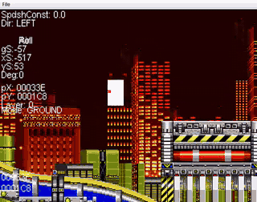

**2025-12-18** — **PSG starts working** — but badly out of tune, and the noise channel is rough.

<audio controls src="assets/timeline/psg-out-of-tune.mp3"></audio>

> ▶ **[Listen (mp3)](assets/timeline/psg-out-of-tune.mp3)**

**2025-12-22** — Still detuned PSG, but **rings exist now** — one of the first objects (with the wrong gaps between them).

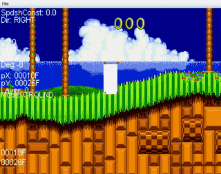

**2026-01-02** — **First build with real Sonic sprites.** Collision is very wonky, no sprite priority yet — and Sonic falls through the terrain ten seconds in. *(whoops!)*

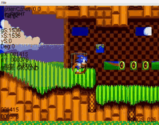

**2026-01-05** — A crude spring with a **comically weak strength** to it — and spikes.

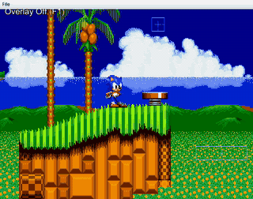

**2026-01-06** — Rings looking better, but the **EHZ bridge goes very jittery.**

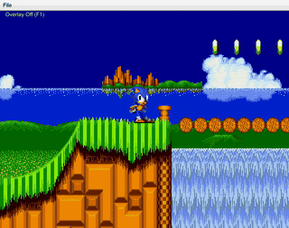

---

## EHZ playable &amp; the special-stage struggle (0.1, Jan 2026)

**2026-01-10** — **First debug overlay, badniks and item monitors** — ending with Sonic falling through the EHZ bridge.

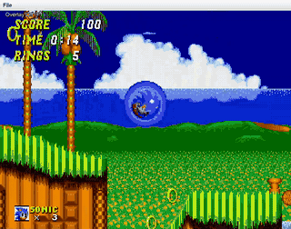

**2026-01-10** — **First full run of EHZ Act 1**, with all the objects and rings in place. Many bugs, but the first time the stage was truly playable.

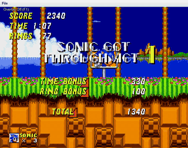

**2026-01-11** — First attempt at **Sonic 2 special stages**: almost incomprehensible garbage tiles.

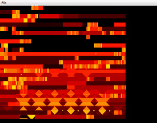

**2026-01-11** — Special stage again — palette now correct, but decompression/mapping bugs leave the half-pipe **almost recognisable but incredibly blocky.**

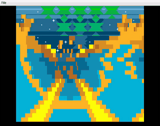

**2026-01-11** — Half-pipe visuals now semi-working, with **mirroring issues breaking left turns.**

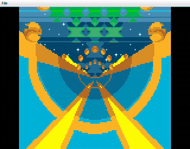

**2026-01-17** — **First full starpost-to-special-stage entry**, with the stage working with rings and Sonic sprites.

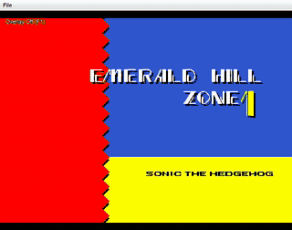

**2026-01-18** — First Chemical Plant work — Sonic looping through the transport tubes. *"I want to get off Dr. Robotnik's wild ride."*

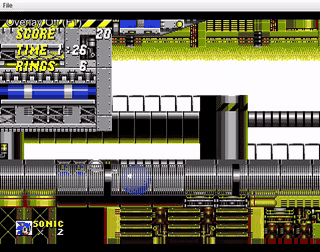

---

## CPZ / ARZ / CNZ and the first bosses (0.2, Jan – Feb 2026)

**2026-01-20** — **Water physics in CPZ**, plus staircase blocks with broken physics.

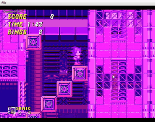

**2026-01-21** — Sonic in an **infinite loop breaking an ARZ pillar** that immediately respawns (with the wrong palette).

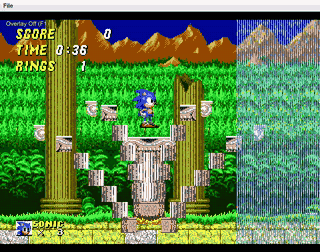

**2026-01-22** — First sight of the **performance graph**, built to work out how efficient the engine actually is.

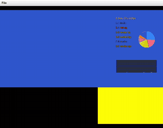

**2026-01-23** — A demo of **Sonic's dust** when he brakes suddenly.

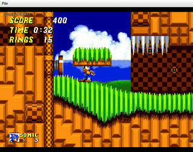

**2026-01-26** — Early demo of the **CNZ slot machine**, 90% working.

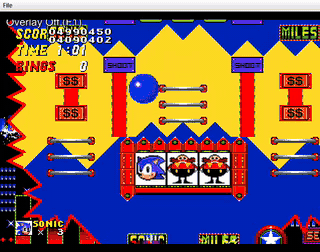

**2026-01-26** — **CNZ slope physics broken**, showcased by a vertical flipper.

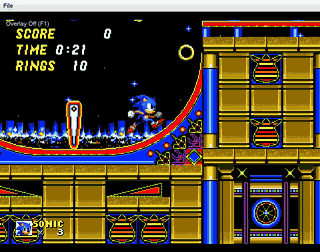

**2026-01-29** — First attempt at a **Sonic 2 boss**. Robotnik looks like he's been through a car crusher.

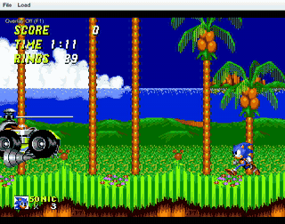

**2026-01-29** — **First defeatable boss.** Robotnik's car wheels look a bit wobbly; the egg prison is a bit buggy.

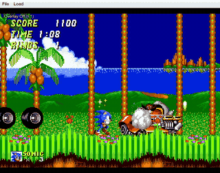

**2026-02-04** — First look at **debug overlay V2** — and Sonic has somehow learned to walk on the ceiling.

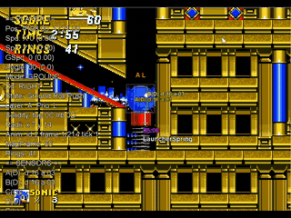

---

## Sonic 3 &amp; Knuckles begins (0.3, Feb 2026)

**2026-02-08** — The **sound-test app**, written to start tackling the audio engine's longstanding issues — beginning with Sonic 1 vs Sonic 3 &amp; Knuckles audio-driver/profile differences. The human's diagnostic oracle for a subsystem that had none.

<audio controls src="assets/timeline/sound-test-app.mp3"></audio>

> ▶ **[Listen (mp3)](assets/timeline/sound-test-app.mp3)**

**2026-02-08** — **First attempt at Sonic 3 &amp; Knuckles support** — a very early prototype of loading S3K tiles.

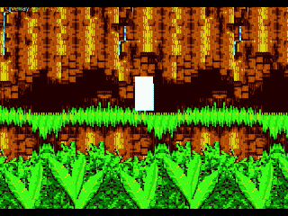

**2026-02-10** — First demo of **Sonic 1 special stage** support. The palette is weird.

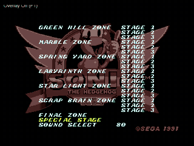

---

## AIZ, shields, and ROM donation (0.4, Feb 2026)

**2026-02-16** — One frame of the **AIZ intro coming together** — across a run of builds it went from a garbled mess to ~90% complete.

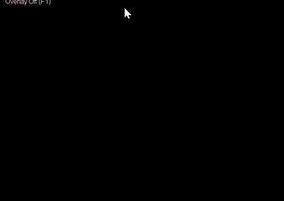

**2026-02-17** — Early **S3K elemental-shield** prototypes.

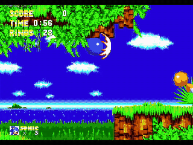

**2026-02-19** — The **AIZ swing-vine completely losing it.** Very funny.

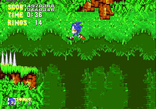

**2026-02-22** — First demo of **ROM donation**: Sonic &amp; Tails (S2 sprites) in Sonic 1's Labyrinth Zone. Underwater Tails' palette is a bit off, but it works.

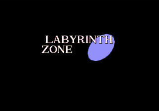

**2026-02-22** — Tails' palette fixed — and **spindash demonstrated in Sonic 1** too.

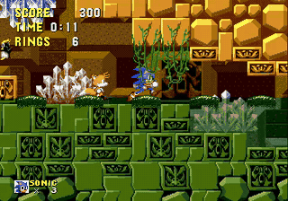

---

## OpenGGF: the rename, Super Sonic everywhere, an army of Sonics (Feb – Apr 2026)

**2026-02-25** — First prototype carrying the **OpenGGF name** — and very early tech for S2's Super Sonic in Sonic 1 *(?!)*.

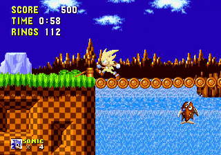

**2026-02-25** — **Sonic 3 sprites donated into Sonic 1**, with S3 &amp; K Super Sonic — while layering sound profiles almost flawlessly (music and SFX from different audio drivers at once).

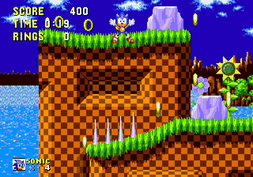

**2026-02-27** — Buggy S2 Death Egg Egg-Robo defeat. The robo's body **refuses to leave Sonic's side**; Sonic 'escapes', dies anyway.

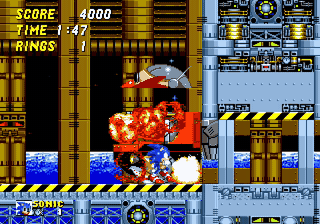

**2026-03-13** — First demo of **seamless AIZ1 → AIZ2 transitions**, with the fire/flame curtain that took a week of someone's life to perfect.

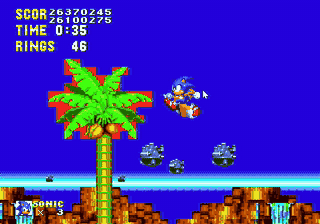

**2026-03-19** — A daft idea: **custom sidekicks identical to the main character.** Thus, Sonic &amp; Sonic in Sonic 2 was born.

**2026-03-19** — Couldn't stop there — **more than one sidekick.** Sonic &amp; Sonic &amp; Sonic &amp; Sonic &amp; … (bugs since fixed).

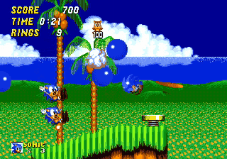

**2026-03-20** — **21 Sonics and 1 Tails**, in AIZ — and the performance monitor shows barely any hit.

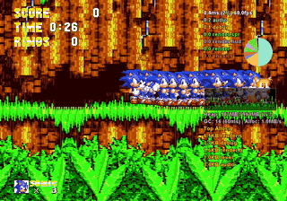

**2026-04-08** — **S3K Pachinko bonus stage** working, with Tails &amp; Knuckles as sidekicks.

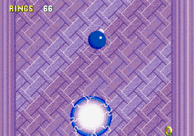

**2026-04-08** — **S3K slot-machine bonus stage** glitching out.

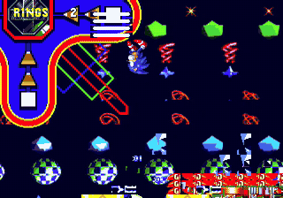

---

*Back to [The AI Journey](AI_JOURNEY.md). For the live accuracy work, see
[`TRACE_FRONTIER_LOG.md`](TRACE_FRONTIER_LOG.md).*
