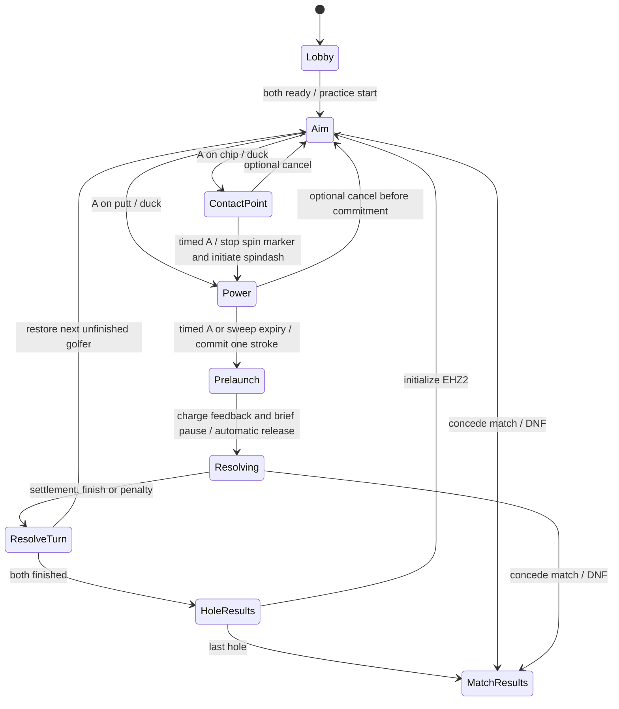

# Putt Putt Paradise

Subtitle: **Sonic 2 Mini Golf**

Date: 2026-10-05

Status: proposed gameplay and implementation brief; no golf implementation delivered

Framework research base: `fa129ccf4` (`develop`, including Infinite Sonic)

Implementation plan: [sequenced tasks and verification](../plans/2026-10-05-putt-putt-paradise.md)

## The game

Play an entire Sonic act as a golf hole, using Sonic or Tails as the ball.
Raise the shot from a ground putt into an airborne chip, time two spindash
charges on the power meter, and watch the character roll through slopes,
loops, springs and badniks.
Players alternate shots until both reach the finish. Lowest total strokes
across Emerald Hill acts 1 and 2 wins.

The influences have distinct jobs: Kirby's Dream Course supplies the
character-as-ball idea and shot setup; Angry Birds supplies the readable
launch arc and the anticipation of watching a committed shot; Sonic supplies
the terrain, momentum, rolling attacks and audiovisual character. Nintendo's
[Dream Course description](https://www.nintendo.com/en-gb/Games/Super-Nintendo/Kirby-s-Dream-Course-758013.html)
confirms its angle, spin, power and alternating multiplayer ingredients.
This proposal adapts those ingredients to a two-dimensional Sonic course;
it does not attempt to reproduce Dream Course's complete rules.

The central pleasure should be turning a familiar route into a sequence of
decisions: a cautious putt to a good lie, a chip over trouble, or a powerful
shot through a loop that saves several strokes if it works.

## MVP boundaries

| Item | MVP decision |
| --- | --- |
| Baseline | Sonic 2 World REV01 ROM, loaded through the existing ROM pipeline |
| Characters | Sonic and Tails; each player chooses independently, including duplicate selections |
| Courses | Full Emerald Hill act 1 and full Emerald Hill act 2, one hole per act |
| Players | One-player practice and two-player alternating competition |
| Local play | Hot seat with one controller/keyboard; two controllers may feed the same turn owner |
| Online play | One player hosts; the other joins by IP/hostname and port |
| Win condition | Fewest strokes plus penalties across both acts; equal totals remain a draw |
| Bosses | None; EHZ2's golf finish replaces its boss/capsule ending |
| Character abilities | Shared golf launch and flight rules initially; no manual running, jumping or Tails flight |
| Infrastructure | No matchmaking, public server directory, relay or account service |

Practice can select either act and restart freely. Competition plays EHZ1
then EHZ2. There is no par claim until complete routes have been playtested.
The full acts may produce long rounds; measure that before deciding whether
a later short-course mode is useful. Do not silently substitute small EHZ
fragments for the requested acts.

## Taking a shot

### 1. Survey and aim

The course is paused. Pan the camera to inspect the next section, then return
to the character. An opponent's last lie is a labeled marker rather than a
physical obstacle. No sidekick AI operates in this mode.

**Up/Down** continuously adjusts elevation: at zero elevation the shot is a
**PUTT**; Up raises it into a **CHIP**, and further Up makes the chip steeper.
Down lowers the chip until it returns to a putt. There is no separate shot-type
toggle. Elevation clamps at zero and the supported maximum rather than wrapping
or becoming a downward shot. **Left/Right** changes the facing and shot direction
without moving the character or changing the selected elevation.

A putt follows the supporting surface's tangent; it is not a world-horizontal
velocity that clips into a slope. Chip elevation is measured away from that
tangent. The implemented range is 0–90 degrees. A 90-degree chip retains full
normal launch speed and adds a small tangent component in the selected facing:
one sixteenth of shot speed, with a minimum of `0x40` native velocity units
(0.25 pixels/step). During ascent only, a wall-stopped X velocity retries that
small forward component. Collision still owns position separation; this allows
the golfer to rise beside a wall and advance after clearing its edge, without
teleporting or steering during WATCH. The retry ends at the apex and yields to
native spring control and nonzero bounce velocities. Short power cannot clear
an arbitrarily tall wall.

Upward Obj41 springs additionally accept rolling entry into either side in
golf. The mod preserves incoming forward momentum through the spring housing
while reusing the native upward impulse, animation, subtype effects and sound.
Side entry omits the ROM's top-landing Y correction. Native top contact and all
other spring orientations retain their existing behavior; stock game modules
never tag these placements or install the namespaced golf factory. These rules participate in the
direct-connect fingerprint and must survive course restore and forward replay.

A dotted guide shows departure at full reference power while aiming. The chip
panel uses the intended contact point; the power panel uses the actual stopped
spin and current meter power. It shares the release velocity calculation,
including surface angle and the standing-to-ball origin correction. The short
preview ends before crossing the initial support plane; it does not predict
terrain, objects, spring contacts, landing spin or a final lie. Previewing never
advances or mutates the real course. Online guests use the host's turn origin,
surface angle and accepted scene camera rather than their held local world.

### 2. Duck and open the shot panel

**A** confirms the selected direction and elevation, makes the main character
duck, and opens power for a putt or contact-point timing for a chip. Direction
and elevation remain locked. The course stays paused while the panel advances
on its presentation clock; ducking and charge feedback cannot creep the
character away from its lie.

### 3. Time contact point and power with A

The user's 2026-10-06 instruction to mimic Kirby's Dream Course supersedes the
previous two additive charges and the unshipped bank-or-boost brainstorm.
[Nintendo's manual](https://manuals.plus/m/67c7da172a34ce3239bc014f14a9514b42e3772456425496419e9a37805b3ddf),
sections 7–8, supplies the shot flow: fly shots time a top/backspin marker, then
power; power rises and falls once, pink identifies full power, and a missed
sweep makes a very light shot. Clock lengths and impulses below are Sonic
adaptations, not a claim of exact SNES physics or frame timings.

First A ducks and opens the panel. A putt proceeds directly to the power gauge.
A chip first offers a moving contact marker: Up/Down sets a desired signed
contact point (-100 backspin, 0 neutral, +100 topspin), with a cyan target band.
A stops the marker; within eight units it matches the target, otherwise its
actual stopped position becomes the spin. The trajectory updates from intended
to actual contact point. This adds a shot-shaping challenge without random error
or silently rewriting the selected elevation/facing.

The next A stops a single 120-tick power sweep (full at tick 60, back to zero at
120); expiry commits zero normalized power, mapped to the existing very light
velocity. Accepted power is 0–1000; the gauge preserves its previous 500-step
resolution, now two units per step, so equal neutral-shot timing retains its
native departure speed.
Commitment costs one stroke. Native charge
feedback, a brief pause, and automatic release follow; no more launch input is
required and extra presses cannot cancel or add charges. B may cancel an
uncommitted panel, but is optional: default keyboard B/C are unbound, so every
shot needs only A and arrows.

Signed chip spin scales the launch's surface tangent by 0.5–1.5, capped at the
normal maximum; its normal component retains the selected elevation. At its
first unassisted floor contact, one capped tangent impulse adds signed spin
carry. Backspin can reverse and topspin carries forward. Afterwards the ordinary
S2 rolling/collision rules own motion. Neutral spin preserves the native
departure. The pending landing impulse, contact target, stopped marker, power,
clocks and button latches are rewind values. Existing spring/wall behavior is
preserved; a neutral 90-degree chip still has only its small forward bias.

The guide shares the release velocity calculation and rolling-centre correction.
AIM/SPIN uses full power and the desired hit point; POWER uses stopped spin and
current meter power. It is a short departure guide, clipped before the starting
support plane, not a terrain/contact or post-landing predictor. Guests consume
authoritative turn surface/roll values and accepted-scene camera coordinates;
they never simulate gameplay to draw their guide. Native charge sounds and the
innate pitch rise remain owned by the original spindash/audio mechanics.

### 4. Watch it play out

Launch the character curled, with ground speed for a putt or a coherent
airborne velocity for a chip. **The character stays rolling until settled**,
through flight, landing, slopes and spring interactions. Native transitions
that would uncurl it before settlement must be suppressed by the scoped shot
rule, rather than ending the shot on landing or at the ordinary unroll threshold.
The shot otherwise uses the S2 terrain collision, gravity, slope response and
rolling behavior. Springs and successful rolling attacks remain useful.
Entering a loop requires sufficient momentum; a weak shot can roll back out.

Directional input cannot steer, brake or start another spindash after release.
The camera follows the shot with lookahead. The active player may concede a
stuck shot as a lost ball. Ordinary menus can pause a local game; an online
room pause is a host-coordinated state, not a client stopping its own clock.
**Start** opens the golf menu/pause in any shot phase. Golf pause holds course
clocks and shot-feedback scheduling; it does not use stock S2's V-int-active
native pause loop. Stock sessions retain their usual pause behavior.

For the MVP, Sonic and Tails share the same golf response. That is an explicit
mod rule, not a claim that all native character routines are identical. Their
ROM art, animation and sound presentation distinguish them. A later ability
variant could give Tails a single short flutter or Sonic a single momentum
burst, but free flight would undermine stroke play and is outside this MVP.

## Rewind a shot

Each golfer has a separate allowance, defaulting to three rewinds per hole and
one per turn. Setup permits hole limits off/3/5/* and turn limits 1/3/*; `*`
means unlimited. Retrying keeps the same turn and consumes the allowance; only
a kept result passes the turn. Budgets are captured with the mode for developer
replay, but remain outside physical course rollback.

The configured rewind key (default R), primary-pad left bumper, or Start menu's
A-operated Rewind Shot command undoes a committed shot, including during native
flight and after settlement. While a rewind remains, a terminal result waits
for A to keep it, before penalties, finishes, turn changes or act loads become
final. With either allowance exhausted or rewinds disabled, outcomes resolve
automatically. A rewind refunds the pending stroke, retires its shot ID, restores
the entire pre-shot course and opens a fresh attempt for the same golfer.

Playback reverses a bounded ROM scene recording while physics is held, then
restores one opaque checkpoint. Sampling adapts to a cap of 128 scenes/8 MiB;
the initial and latest views are retained. Longer shots traverse more source
ticks per presentation tick, finishing within 90 ticks. Forward physics is
never simulated in reverse, and online guests receive only authoritative value
scenes and allowance/score updates. The host validates shot owner and current
identity; a retired request cannot spend another allowance or revive a stroke.

The mode owns live rewind input in every mode, even with the allowance off.
Genesis movie replay uses the Start-menu command; raw key/bumper input is not
part of a BK2 row and is ignored under logical input overrides. Online peers
must select matching rewind rules, which are part of their rules fingerprint.
Reconnect republishes the current phase, remaining budgets and retry receipt.

## A lie, a penalty, and a finished hole

A shot ends when the character has a valid floor support and remains below a
small **support-relative** movement threshold for a short dwell. Landing alone
does not finish the shot: a character still rolling downhill is still playing.
On moving supports, compare movement relative to the support rather than
requiring zero world velocity. A wall or ceiling contact is not a valid lie.

At settlement, pin the character to that valid lie and pause the course. This
small golf-specific stop rule prevents an almost stationary character from
drifting while someone uses the meters. Do not teleport it to a convenient
tile or flatten its supporting slope. Only after settlement is accepted may
the character uncurl into its neutral aiming pose. Use a contact-safe radius
and centre conversion; preserve support identity and coherent collision state
when saving the lie. The next shot starts by ducking on A, not by walking or
performing an uncontrolled native spindash.

The first playable prototype must specifically test shots that stall inside
loops, reverse on slopes, and land on supports. A bounded simulation watchdog
handles endless spring cycles or an unreachable settlement; its duration must
be set from observed EHZ shots. It resolves as a lost ball, not an unearned
forward reposition. Successful long rolling shots should remain possible.

| Outcome | Rule |
| --- | --- |
| Settled on valid support | Save the new lie and end the turn |
| Crossed the finish gate during the shot | Finish immediately, including at high speed |
| Fell into a pit or received a damaging hit | Shot counts, add one penalty stroke, restore the pre-shot course state and lie, end the turn |
| Conceded or watchdog declared a lost ball | Same penalty and pre-shot restore |
| Defeated a badnik while attacking | Normal rolling attack interaction; shot continues |
| Picked up rings | Keep them as optional collectible statistics; they do not buy shots or prevent golf penalties |

Resolve competing outcomes once at the completed step boundary: damaging hit
or death first, then finish, valid settlement, explicit lost ball, and watchdog
expiry. Damage therefore wins over a finish in the same step; a finish or valid
settlement wins over a simultaneous timeout. Ignore lost-ball input after a
shot has resolved. This is an explicit step-level rule, not a claim to reconstruct
sub-frame collision chronology.

Detect the finish as a swept crossing so a fast shot cannot pass through it
between samples. The gate must span the intended finishing route. It is a
golf trigger with its own result handling, not the stock object launching an
ordinary act transition. No precise cup speed requirement is needed initially:
the stated goal is reaching the end of the level.

The standard lives, ten-minute time limit, ring-funded extra lives, super
transformations, special-stage entrances and stock results progression do not
decide a golf match. Omit monitors that would grant speed, invulnerability,
shields or lives rather than letting them silently change the shared shot
rules. Star posts may remain visual landmarks but do not grant free relocation.
Rings and ordinary badniks remain recognizable optional route features.

Penalty restoration restores the **whole pre-shot course state**, including
objects, pickups and simulation clocks, not just character coordinates.
Strokes and penalties live in the match ledger and survive that restore.
There is no finite life pool and no automatic game over after repeated misses.

## Two players, alternating turns

Each golfer has an independent evolving copy of the course. Both start from
equivalent initial world conditions. Rings collected, badniks defeated,
objects activated and world time advanced by one golfer do not affect the
other golfer. Each golfer's course is paused while the other takes a turn.
This preserves the full S2 scenery without a turn-order advantage from
consuming pickups or clearing enemies first.

Only one course is active in the gameplay engine at a time. Save its complete
state after a turn and restore the next golfer's state at a supported engine
boundary. The inactive golfer appears only as a lie marker. This is a required
isolation capability to prove, not an assertion that current rewind objects
can already be swapped between arbitrary sessions.

Play order is P1, P2, P1, P2. Reverse the starting player for EHZ2. Reaching the
finish does not end the opponent's hole; the unfinished golfer continues until
they finish or concede. Competition uses the same selectable per-golfer rewind
allowance; a retry restores that shot without passing ownership or refreshing
the per-turn budget.
Conceding a competitive hole concedes the match: record DNF and an opponent win,
rather than assigning an invented stroke total. Offer continued solo practice
afterward. If both leave without a result, record no winner.

The HUD shows course, active player, stroke totals, shot type, power and chip
angle. A turn announcement recentres the camera. Chip contact timing shows a
moving hit marker and cyan intended-contact band, with a top/backspin diagram.
The subsequent power sweep highlights full power in pink. During flight the
lower strip reduces to stroke and player information. Results show strokes,
penalties and total for each act.
Rings remain secondary statistics and do not break a tied golf score.

## Emerald Hill course treatment

**EHZ1** is the introduction: keep its ROM layout, paths, terrain and ordinary
course interactions. Put the golf finish at the normal end-of-act destination
and intercept the stock signpost/results flow. Teach a modest putt, a chip,
and the difference between landing and settlement before expecting a loop
shot. Tutorial overlays must not add hidden power boosts or special collision.

**EHZ2** is the second full course: keep its ROM route and replace the ending
with a clearly marked golf gate at the former boss/capsule destination.
Suppress the boss spawn, arena lock, boss music, defeat/capsule prerequisites
and normal progression together. Removing only the boss object is insufficient
because its owning level-event flow can still trap the player or block finishing.
Confirm the exact gate and camera bounds against the loaded ROM map during
implementation; this concept does not claim surveyed coordinates.

Backshots and rollback must be camera-visible. Camera surveying must not
activate, destroy or respawn objects in the authoritative world. Survey is a
presentation view of the course; it cannot move the simulation's object-loading
window. Keep native course state and the view camera separate where needed.

No bespoke course terrain is required for the first prototype. If full-act
playtesting exposes an impossible lie or route, first determine whether launch,
settlement or collision ownership is wrong. Any intentional golf terrain edits
must be explicit course data applied through the mutation pipeline, never
unexplained fixes to the stock S2 game.

## Direct-connect online play

The lobby offers **Host** and **Join**. Host chooses a port and match settings;
Join enters an IP/hostname and port. Both choose a character and ready up.
LAN works with the host's reachable address. Internet play requires a reachable
host port, such as manual TCP port forwarding; this MVP does not promise NAT
traversal. Each machine has its own ROM and matching mod installation.

Use a small ordered protocol over TCP or WebSocket/TCP. Turn-based golf needs
reliable commands more than low-latency remote steering. The host owns both
course states, shot simulation, penalties, turn order and score. Remote clients
never submit their own lie or resulting score as authoritative gameplay.

The active player runs the power meter locally and submits the **locked result**
(direction, elevation, normalized power and signed spin), tagged with
match, hole, turn and shot identities. The host derives velocity from the shared power/spin rules. This deliberately trusts the player's meter results;
no anti-cheat project is needed. Bounds, turn ownership and duplicate handling
still prevent accidental double shots and invalid session state. Network
round-trip time must not decide whether the marker hit the intended spot.

The host accepts the shot, increments its stroke once, completes the charge
feedback and prelaunch pause, runs the shot, and sends a bounded presentation
stream so both players can watch. That stream needs the
active character, relevant object poses/visibility, camera and course visual
changes. A player ghost stream alone cannot show moving bridges or destroyed
badniks. Guests render that presentation using locally loaded art; they do not
feed presentation coordinates into their native gameplay simulation.

At the end, the host sends a committed result with the new lie, score and next
turn. Only then does the next golfer's aim phase start. The remote golfer needs
the host's current course presentation to aim, but does not need a serialized
native gameplay snapshot. Full course state remains on the host.

| Message family | Purpose |
| --- | --- |
| Hello / Ready | Protocol, engine/mod/course-rule fingerprints, ROM identity, character and settings |
| TurnOpened | Active player, turn identity, lie, score and current course presentation |
| ShotRequest / ShotAccepted | Submit the locked shot and accept it exactly once |
| PresentationFrame | Watch the authoritative shot without remote gameplay ownership |
| TurnCommitted | Publish settlement/finish/penalty and the authoritative next state |
| Pause / Resume / Leave | Coordinate session lifecycle and release its resources |

A disconnect pauses the room. A short reconnect window can retain the match in
host memory and resend its current presentation and committed ledger; it must
not reapply an accepted shot. If the host quits, the match ends. Host migration,
disk-persisted online matches and replay verification are beyond the MVP.
No ROM or ROM-art payload is transferred.

## Fit with the framework

Research inspected the maintained [creator handbook](../../modding/index.md),
[content contracts](../../modding/content-mods.md),
[character contracts](../../modding/characters.md),
[next-line subsystem reference](../next-line-subsystems.md),
[API compatibility policy](../mod-api-compatibility.md), and the integrated
[Infinite Sonic example](../../../examples/infinite-sonic/README.md) at
`fa129ccf4`. These establish useful building blocks, not a turnkey golf mode.

Use a namespaced code-bearing S2 patch, distributed as an external mod example
and run through the JVM jar. Reuse ROM-backed EHZ assets and stock character art.
Keep gameplay in mod/session owners with injected services and rewind capture;
do not add a golf-specific branch to `Engine.java` or load disassembly assets.
An illustrative future directory is `examples/putt-putt-paradise/`; it does not
exist as an implementation because this document is the concept deliverable.

| Capability | Current evidence and proposed treatment |
| --- | --- |
| ROM-backed module decoration | `GamePatch` / `DelegatingGameModule`; Infinite Sonic already decorates a ROM game |
| Level event and physics providers | Existing module seams; use golf-scoped providers for EHZ ending behavior and explicit shared shot rules |
| Shot launch and rolling retention | Playable state and velocity methods exist; prove a coherent rolling/airborne launch and retained curled state through contacts until settlement before claiming an adequate supported seam |
| Input ownership | Deterministic launch input filters exist for owned mod destinations; do not assume their tagged-zone registration automatically covers stock EHZ patch launches |
| HUD | The published HUD profile is row-only; an aim arc and animated meters need a richer overlay or a supported mod rendering adapter |
| Menu and camera | Existing title providers and Infinite Sonic presentation/controller code offer examples; survey without altering the object-loading window still needs proof |
| Course pause | Paused gameplay with live meter/lobby updates is required; `gameplayStepsPerFrame()` is clamped to at least one and is not a zero-step pause hook |
| Independent golfer course states | Existing rewind machinery is a foundation; audited full-state turn save/restore and timeline isolation are additional obligations |
| Direct networking | Existing `RaceHostServer` is a WebSocket direct-connect example; its race/ghost protocol is not the golf command and presentation protocol |
| Remote course presentation | Requires a supported read-only presentation path for relevant objects as well as the character; currently an implementation gap to resolve |

Prefer bounded additions for gameplay admission, launch/input ownership,
presentation and isolated state capture if the current supported surface cannot
express the mode. Keep shared code semantic and reusable for another turn-based
mod. Do not silently rely on unannotated internals or expose unrestricted engine
and renderer objects merely to finish the example. Any actual Mod API change
must update the descriptor, version and signature pins under the existing policy.

Native rewind snapshots are in-memory state, not an established network save
format. The online design intentionally keeps them on the host. Presentation
packets need their own bounded value schema and cannot serialize arbitrary
object graphs or transmit executable creator content.

## Implementation order and acceptance

1. **Prove the shot.** One golfer, EHZ1, temporary direct power/angle controls.
   Demonstrate short putts, steep chips, slopes, successful loops, rollback,
   settlement and the signpost-area golf finish using ROM-backed assets.
2. **Add the game feel.** Up/Down elevation, Left/Right direction, A-to-duck,
   Dream Course contact/power timing preserving native charge feedback, brief prelaunch
   pause, automatic release and rolling until settlement. Add the truthful departure
   guide, survey camera, shot HUD and penalty flow. Remove free movement and
   stock progression/reward systems from the golf session.
3. **Prove alternating play.** Two independent golfer course states, both
   characters and duplicate choices, reversible turn handoff, complete EHZ2
   without the boss flow, and the two-hole scorecard.
4. **Deliver direct-connect play.** Host-authoritative commands and course
   presentation, local meter timing, mismatch rejection, duplicate handling,
   disconnect pause and session cleanup. Local play and online play share the
   same match rules rather than separate scoring implementations.

These are development slices of one MVP. Two-player play and a working direct
connection remain delivery requirements; a one-player prototype alone does not
fulfil the brief. The riskiest feasibility work is course-state isolation and
remote world presentation, not the power meter.

| Acceptance scenario | Required observable behavior |
| --- | --- |
| Up/Down elevation and Left/Right direction | Up raises putt into progressively steeper chips; Down returns to putt; facing changes without moving the character |
| A shot panel | Putts time power; chips time contact point then power; native feedback and pause lead to automatic release |
| Contact point and power | Intended/actual spin updates the guide; one power sweep expires to a very light shot; loft and facing remain locked |
| Native spindash feedback | Preserve S2's existing charge sounds and pitch rise; extra A presses after commitment do not add charges or count strokes |
| Very weak / full-power putt | Distinct useful distances, coherent rolling state, no input steering |
| Chip onto a slope | Native collision resolves landing; turn waits for settlement |
| Rolling retention through flight and contacts | Character remains curled through landing, spring interactions and low-speed motion until settlement is accepted |
| Weak and strong loop attempts | Weak shot can reverse; sufficient momentum completes the loop |
| Settling on a moving support | Relative dwell works; restored lie retains the correct support |
| Camera survey | No change to object membership, pickup state, timers or the eventual shot result |
| Pit, spikes, damaging badnik contact | Exactly one shot plus one penalty; complete pre-shot state restored |
| Successful rolling badnik attack | Enemy interaction resolves without an invented penalty |
| Spring cycle or declared lost ball | Bounded recovery, no free forward lie, turn advances |
| Fast finish crossing | Finish is detected once, without stock results or act transition |
| EHZ2 finish | No boss, boss lock, capsule dependency or accidental normal progression |
| P1 changes pickups and objects | P2's world remains at its own saved state and clock |
| Turn and hole boundaries | Restored character, art, objects, managers, support, camera and clocks are internally coherent |
| All character pairings | Sonic/Sonic, Sonic/Tails, Tails/Sonic and Tails/Tails complete both acts |
| Delayed or duplicate online request | Meters retain local timing; stroke is accepted at most once |
| Remote spectating | Character and relevant course objects agree with the host presentation |
| Disconnect and reconnect | No duplicate launch or score; paused state resumes or exits cleanly |
| Mod teardown | Network resources close; stock S2 sessions regain their ordinary rules and presentation |

Implementation must supply per-act/character route matrices and record the
mod's intentional differences under the
[level test standard](../../guide/contributing/level-test-standard.md).
Cover capture/restore and forward replay across charging, prelaunch feedback
and pause, shots, penalties, handoffs and loads, including isolated timelines.
Debug rewind within an offline test must capture the complete golf state,
including charge stage, values and presentation timers; competitive UI does
not expose a free retry.
Record/replay one mode iteration per presentation tick, including held aiming
ticks, through the same coordinator used for live input. Retain prior debug
history across penalty/course handoff; real act loads reset history and isolate
the new course generation. Held duck/charge/dust animation uses a render-only
native-ROM pose phase, not world object updates, and native sound requests have
their own correctly mapped iteration stamps. Guest charging uses this local
render-only pose until authoritative acceptance arrives.
Test supported viewport widths because the aim HUD and survey camera are part
of play. All ROM-backed checks must use discovered absolute S2 ROM paths and
report skips; no engine tests have been run to validate this proposal.

## Decisions and rejected shortcuts

- **Full acts, not cropped hole substitutes:** the requested goal is reaching
  the end of EHZ1 and EHZ2. Round length is a playtest question.
- **Independent course copies, not shared mutable pickups:** consuming a ring
  or badnik first would otherwise change the other golfer's challenge. This
  choice knowingly adds state-isolation work.
- **Committed shots, not continuous platformer control:** unrestricted steering
  or Tails flight would make launch planning and stroke scoring secondary.
- **Two timed charges, automatic release:** the user's control refinement
  replaces the original document's separate accuracy stage (`9a263f828`).
  Up/Down supplies continuous elevation from putt through chip; both timed A
  hits build power through the game's existing spindash charge feedback,
  preserving its innate pitch rise, followed by a brief pause before release.
  Pitch behavior is preserved game functionality, not an added golf feature.
  Rolling persists until settlement instead of inheriting native early unroll.
- **Gate finish, not precision-speed cup entry:** crossing the act endpoint
  fulfils the requested goal and avoids an extra finishing mechanic in the MVP.
- **Host simulation, not client-claimed results or two authoritative replays:**
  one owner avoids treating divergent peers as equally correct. Local meter
  outcomes remain trusted as requested.
- **Presentation values, not serialized rewind graphs:** existing snapshots
  do not establish a safe or compatible wire format; guests need to watch,
  while the host retains gameplay ownership.
- **Dedicated golf protocol, not race-ghost reuse by assumption:** the inspected
  race transport demonstrates connection plumbing, but cannot itself advance
  turns or display the complete evolving golf course.

These decisions are reasoned concept choices from the brief and the inspected
contracts at `fa129ccf4`, not experimental claims. Proposed tuning values,
par scores, gate coordinates and completion times remain deliberately unset
until the first ROM-backed playable slice supplies evidence.
